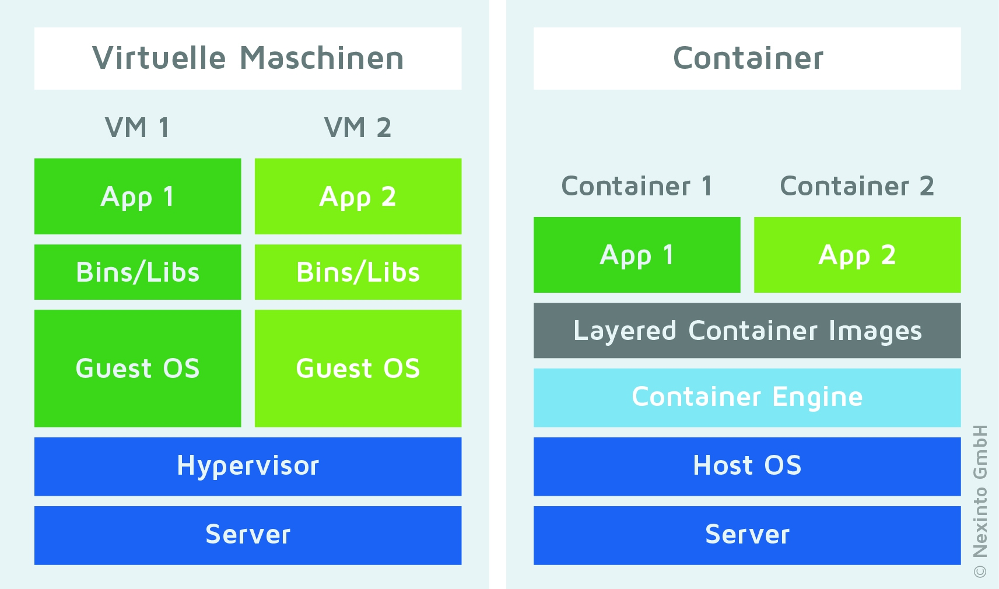
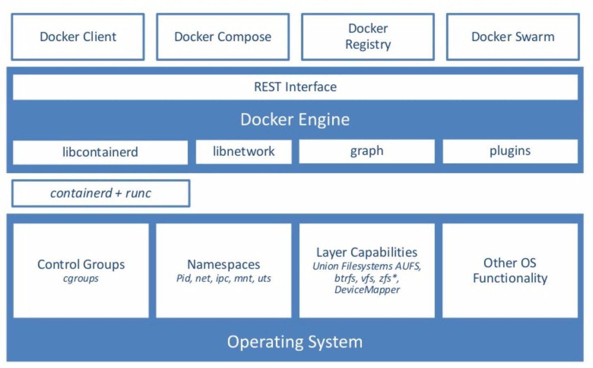
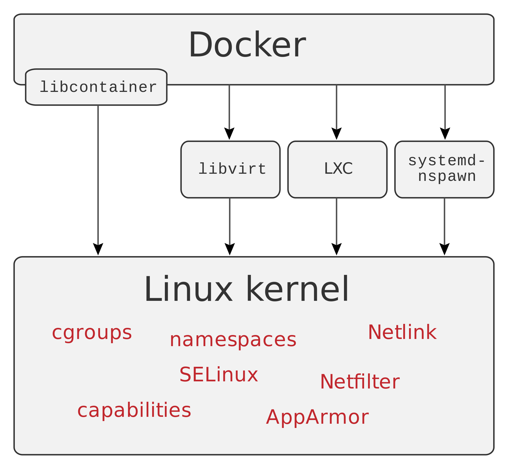
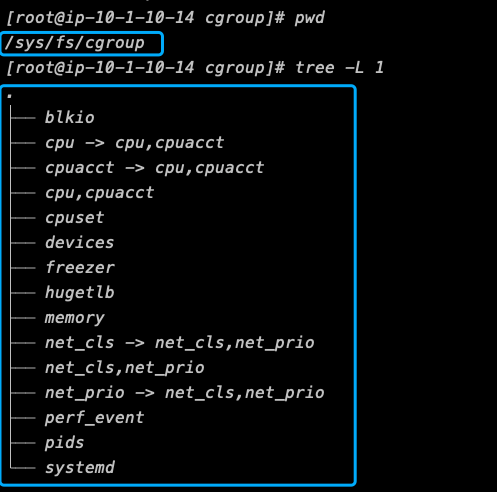
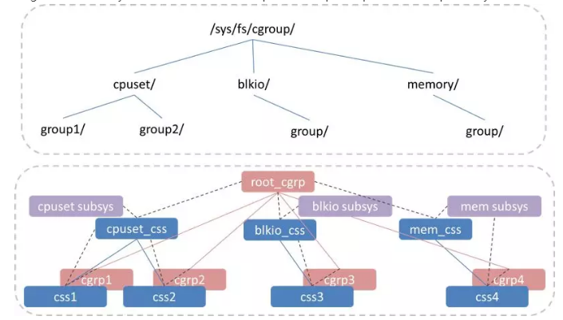

# Docker101
===============================


#### 1. what's docker
---------------

* Offical: Docker is an open platform for developping, shipping, and running(distributed) applications
* Container Creation/management software
* Performs OS-Level virtualization
* Simplifies deployment workflows
* Avoid the "it works on my machine" issue
* Local environments are equivalent to production environments
* Easy to use CI/CD technologies
* Using namespace `isolation` and cgroups `resorce contorl`
* Build once, Run anywhere

#### 2. Docker engine
---------------

Docker Engine is a client-server application with these major components:

* A server long-running daemon process(`dockerd` command)

* A Restful API talks with daemon process and instruct

* A command client line(CLI) client(`docker` command)

```bash
    CLI                                                         Server 
docker client   <---------->   Restful API  <----------->  docker daemon
```

 

What can I use Docker for？

1. Fast, consistent delivery of your applications
2. Responsive deployment and scaling
3. Running more workloads on the same hardware

#### 3. Architecture
---------------

Docker uses a client-server architecture.


* 3.1 **The Docker Daemon**

    > The Docker daemon (dockerd) listens for Docker API requests and manages Docker objects such as images, containers, networks, and volumes.

* 3.2 **The Docker Client**

    > The Docker client (docker) is the primary way that many Docker users interact with Docker.

* 3.3 **The Docker registries**

    > A Docker registry stores Docker images. Docker Hub is a public registry that anyone can use, and Docker is configured to look for images on Docker Hub by default. You can even run your own private registry.

* 3.4 **Docker Images**
    > An image is a read-only template with instructions for creating a Docker container.

* 3.5 **Docker Conatiners**
    > A container is a runnable instance of an image. You can create, start, stop, move, or delete a container using the Docker API or CLI.

#### 4. Docker vs VM
---------------



#### 5. The underlying technology
---------------





* cgroups
    * control groups
    * Resource accounting(with hierarchy)
    * Much more sophisticated than `ulimit`
    * A filesystem
    * Limit and prioritize 
    * Classify network packets
    * Freeze process






* namespaces
    > Docker uses a technology called namespaces to provide the isolated workspace called the container. When you run a container, Docker creates a set of namespaces for that container. These namespaces provide a layer of isolation.

    Docker Engine uses namespaces such as the following on Linux:

    * The pid namespace: Process isolation (PID: Process ID).
    * The net namespace: Managing network interfaces (NET: Networking).
    * The ipc namespace: Managing access to IPC resources (IPC: InterProcess Communication).
    * The mnt namespace: Managing filesystem mount points (MNT: Mount).
    * The uts namespace: Isolating kernel and version identifiers. (UTS: Unix Timesharing System).


* union filesystem

    > Union file systems, or UnionFS, are file systems that operate by creating layers, making them very lightweight and fast.

