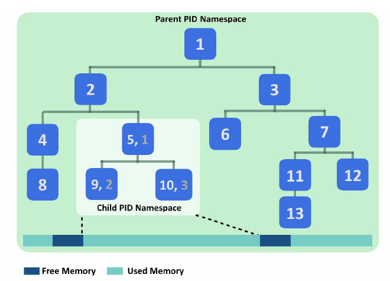
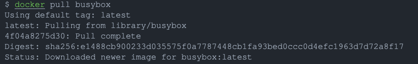
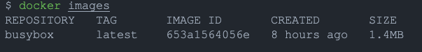
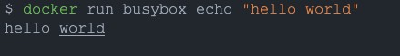
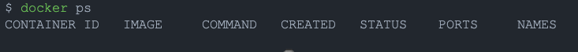
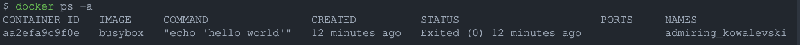
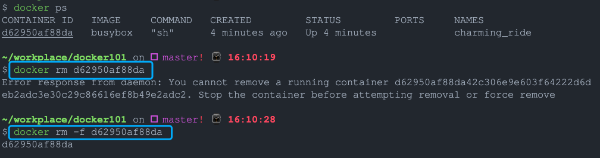
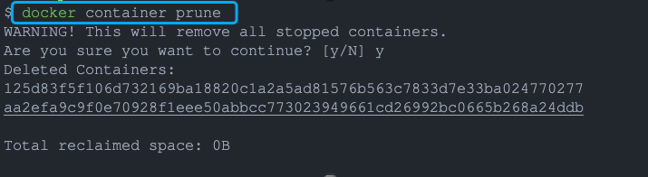
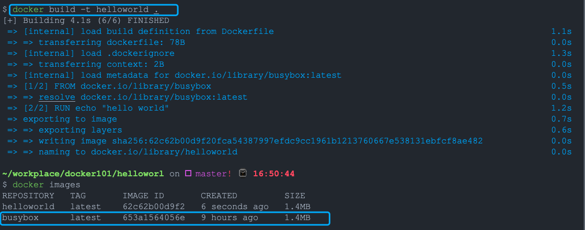

# Docker101
--------------------------

### 1. what's docker
---------------

* Offical: Docker is an open platform for developping, shipping, and running(distributed) applications
* Container Creation/management software
* Performs OS-Level virtualization
* Simplifies deployment workflows
* Avoid the "it works on my machine" issue
* Local environments are equivalent to production environments
* Easy to use CI/CD technologies
* Using namespace `isolation` and cgroups `resorce contorl`
* Build once, Run anywhere

### 2. Docker engine
---------------

Docker Engine is a client-server application with these major components:

* A server long-running daemon process(`dockerd` command)

* A Restful API talks with daemon process and instruct

* A command client line(CLI) client(`docker` command)

```bash
    CLI                                                         Server 
docker client   <---------->   Restful API  <----------->  docker daemon
```

 

What can I use Docker for？

1. Fast, consistent delivery of your applications
2. Responsive deployment and scaling
3. Running more workloads on the same hardware

### 3. Architecture
---------------

Docker uses a client-server architecture.


* 3.1 **The Docker Daemon**

    > The Docker daemon (dockerd) listens for Docker API requests and manages Docker objects such as images, containers, networks, and volumes.

* 3.2 **The Docker Client**

    > The Docker client (docker) is the primary way that many Docker users interact with Docker.

* 3.3 **The Docker registries**

    > A Docker registry stores Docker images. Docker Hub is a public registry that anyone can use, and Docker is configured to look for images on Docker Hub by default. You can even run your own private registry.

* 3.4 **Docker Images**
    > An image is a read-only template with instructions for creating a Docker container.

* 3.5 **Docker Conatiners**
    > A container is a runnable instance of an image. You can create, start, stop, move, or delete a container using the Docker API or CLI.

### 4. Docker vs VM
---------------


### 5. The underlying technology
---------------


* cgroups
    * control groups
    * Resource accounting(with hierarchy)
    * Much more sophisticated than `ulimit`
    * A filesystem
    * Limit and prioritize 
    * Classify network packets
    * Freeze process


* namespaces
    > Docker uses a technology called namespaces to provide the isolated workspace called the container. When you run a container, Docker creates a set of namespaces for that container. These namespaces provide a layer of isolation.

    Docker Engine uses namespaces such as the following on Linux:

    * The pid namespace: Process isolation (PID: Process ID).
    * The net namespace: Managing network interfaces (NET: Networking).
    * The ipc namespace: Managing access to IPC resources (IPC: InterProcess Communication).
    * The mnt namespace: Managing filesystem mount points (MNT: Mount).
    * The uts namespace: Isolating kernel and version identifiers. (UTS: Unix Timesharing System).



* union filesystem

    > Union file systems, or UnionFS, are file systems that operate by creating layers, making them very lightweight and fast.


### 6. Install docker
---------------

[Centos 7](https://docs.docker.com/engine/install/centos/)
[Debian 10](https://docs.docker.com/engine/install/debian/)
[Ubuntu 20.04](https://docs.docker.com/engine/install/ubuntu/)
[MacOS](https://docs.docker.com/docker-for-mac/install/)

### 7. Hello world
---------------

pull a image named busybox from dockerhub

```bash
docker pull busybox
```


list all local docker image on the machine
```bash
docker images
```


run a command to echo `hello world`
```bash
docker run busybox echo "hello world"
```


list containers which are running
```bash
docker ps
```


list all containers
```bash
docker ps -a
```


running the `run` command with the `-it` flags attaches us to an interactive tty in the container
```bash
docker run -it busybox sh
```
remove a running container
```bash
docker rm -f d62950af88da
```


delete a docker images
```bash
docker rmi -f 653a1564056e
```

remove all running containers
```bash
docker container prune
```


### 7. Dockerfile
---------------

A Dockerfile is a simple text file that contains a list of commands that the Docker client calls while creating an image.

A simple dockerfile like this:

```dockerfile
FROM busybox
RUN echo "hello world"
```

Each instruction creates one layer:

* FROM creates a layer from the BusyBox Docker image.
* RUN builds your application with make.

Build a docker image

```bash
mkdir helloworld
cd helloworld
echo "FROM busybox\nRUN echo \"hello world\"" > Dockerfile
docker build -t helloworld .
```



### 8. Dockerfile directives
----------------

* FROM: set base image, eg: `FROM ubuntu:18.04`
* ADD: add files and directories from host system to the image during build,  eg: `ADD files /data`
* COPY: copy files and directories from host system to the image during build, eg: `COPY data/ /data`
* ENV:  set environment variable for specific service of container, eg: `ENV PATH=$PATH:/usr/local/pgsql/bin/`
* EXPOSE: indicates the ports on which a container will listen for the connections, eg: `EXPOSE 8080`
* LABEL: organize images in a proper way, eg: `LABEL maintainer="li.dawei@netstars.co.jp`
* CMD:  run the service or software contained by your image, eg: `CMD ["ls", "-lrt", "/usr/local"]`
* VOLUME: creates a mount point with the specified name and marks it as holding externally mounted volumes from native host or other containers, eg: `VOLUME ["/data"]`
* WORKDIR: sets the working directory for any RUN, CMD, ENTRYPOINT, COPY and ADD commands during build. eg: `WORKDIR /opt`
* ENDPOINT: is the other instruction used to configure how the container will run. Just like with CMD, you need to specify a command and parameters. eg: `ENTRYPOINT [“echo”, “Hello World”]`

### 9. Docker commands
------------------

